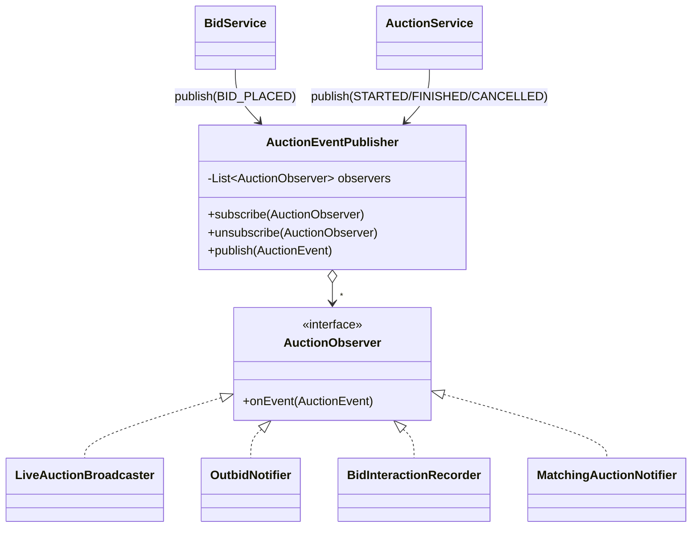
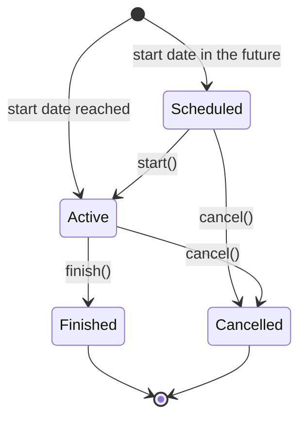
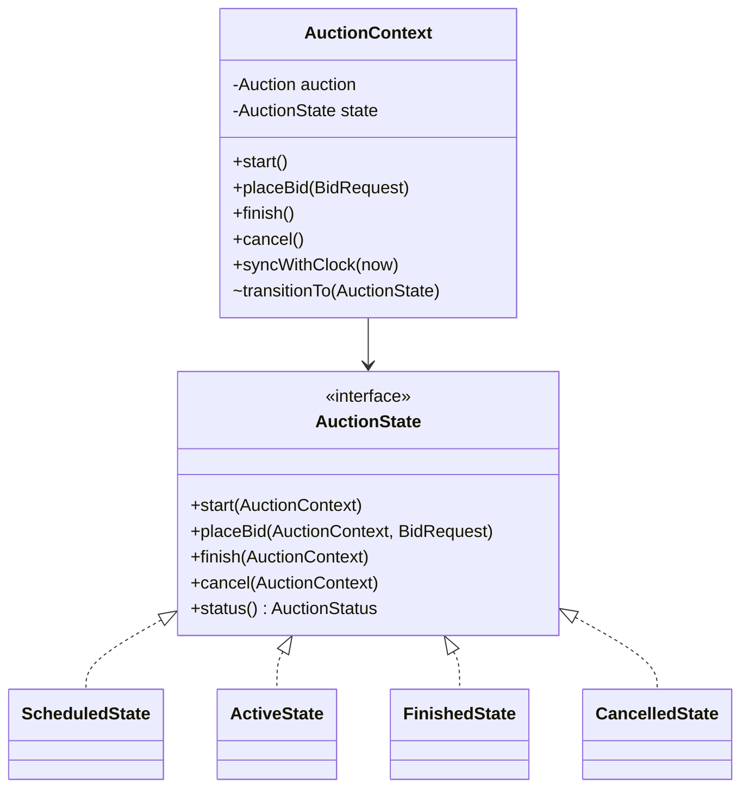
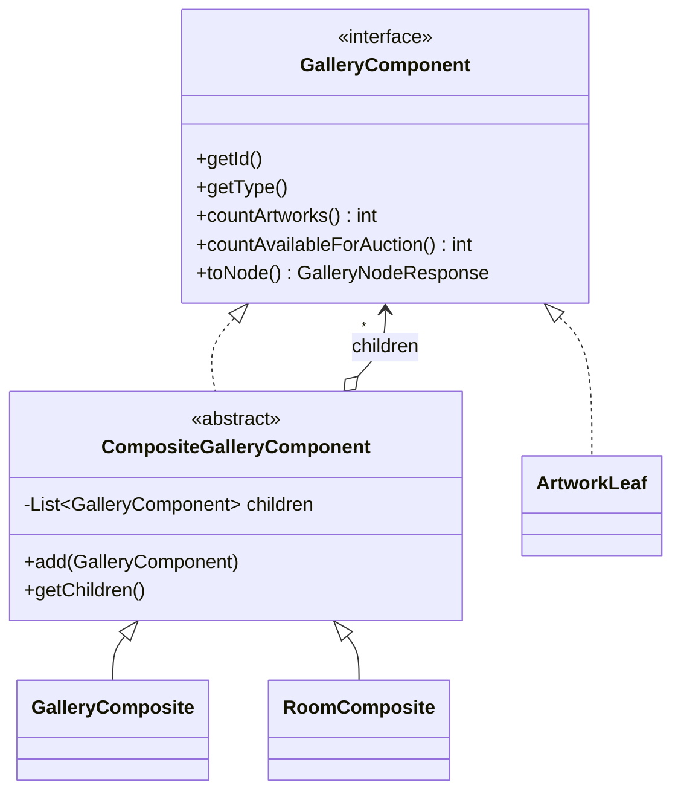
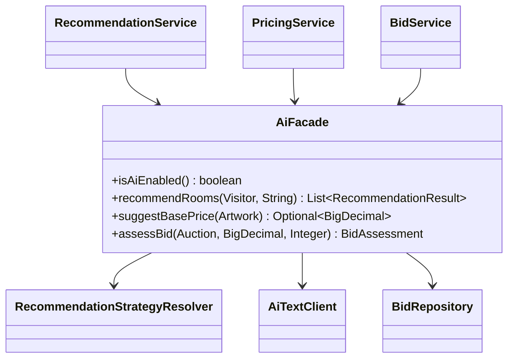
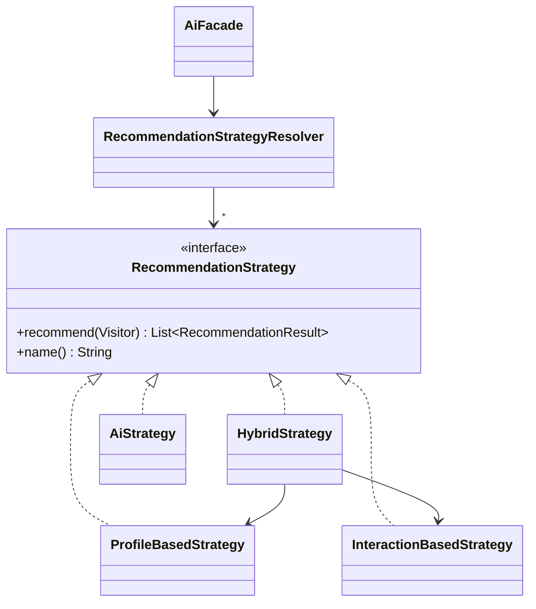
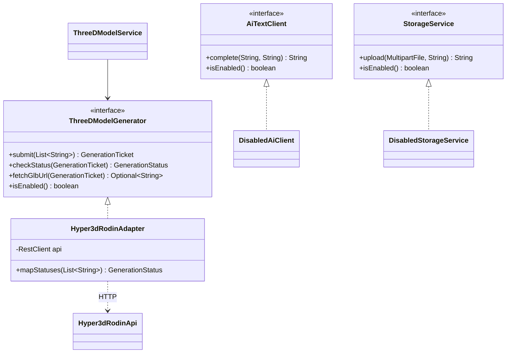
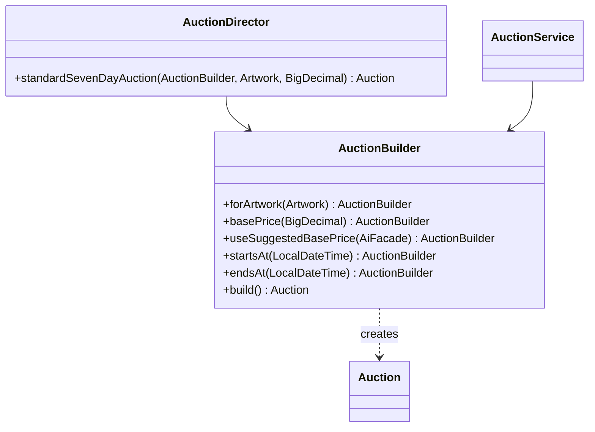
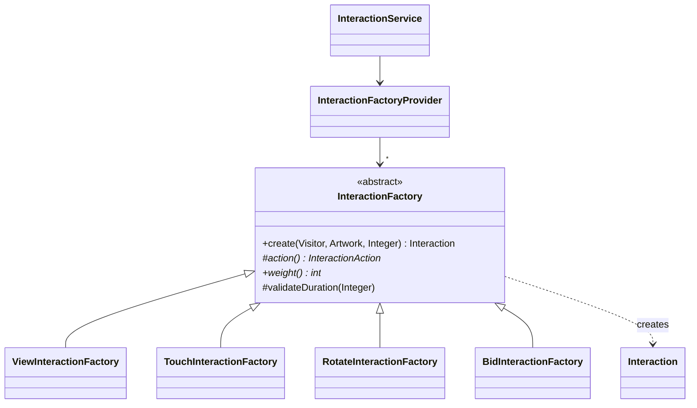

# Design patterns in the Barniz Gallery backend

The backend implements **8 design patterns**. Every pattern class lives under
`src/main/java/com/barnizgallery/backend/patterns/` and has a Javadoc with its GoF role.

| # | Pattern | Category | Origin | Package | Where to see it |
|---|---|---|---|---|---|
| 1 | Observer | Behavioral | Researched (outside the syllabus) | `patterns.observer` | `POST /api/auctions/{id}/bids` + WebSocket |
| 2 | State | Behavioral | Researched (outside the syllabus) | `patterns.state` | `POST /api/auctions/{id}/start\|finish\|cancel` |
| 3 | Composite | Structural | Researched (outside the syllabus) | `patterns.composite` | `GET /api/gallery` |
| 4 | Facade | Structural | Researched (outside the syllabus) | `patterns.facade` | recommendations, suggested price, bid review |
| 5 | Strategy | Behavioral | Researched (outside the syllabus) | `patterns.strategy` | `POST /api/visitors/{id}/recommendations?strategy=` |
| 6 | Adapter | Structural | Syllabus | `patterns.adapter` | `POST /api/artworks/{id}/model/generate`, `/api/health` |
| 7 | Builder | Creational | Syllabus | `patterns.builder` | `POST /api/auctions` |
| 8 | Factory Method | Creational | Syllabus | `patterns.factorymethod` | `POST /api/interactions` |

Paths below are relative to `src/main/java/com/barnizgallery/backend/`.

---

## 1. Observer – auction notifications

**Problem.** When a bid arrives, several things must happen: broadcast it live, warn the visitor who was
outbid, record a "bid" interaction for recommendations, and (when an auction starts) notify visitors
with matching tastes. If `BidService` did all of that itself it would depend on every one of those
features and grow with each new one.

**Solution.** `BidService` and `AuctionService` only publish an `AuctionEvent` to a Subject. Each
reaction is an independent Observer registered in the Subject. Adding a new reaction means adding a
new observer class; the services do not change. It is implemented explicitly (not with Spring's
`ApplicationEventPublisher`) so the roles are visible.

| GoF role | Class |
|---|---|
| Subject | `patterns/observer/AuctionEventPublisher.java` (`subscribe`, `unsubscribe`, `publish`) |
| Observer | `patterns/observer/AuctionObserver.java` |
| ConcreteObserver | `LiveAuctionBroadcaster` → `/topic/auctions/{id}` |
| ConcreteObserver | `OutbidNotifier` → `/topic/visitors/{id}/notifications` |
| ConcreteObserver | `BidInteractionRecorder` → saves a BID interaction (uses the Factory Method) |
| ConcreteObserver | `MatchingAuctionNotifier` → notifies visitors whose colors match the artwork |
| Event | `patterns/observer/AuctionEvent.java` |
| Clients | `service/BidService.java`, `service/AuctionService.java` |

**See it working:** subscribe to `/topic/auctions/{id}` and place a bid with `POST /api/auctions/{id}/bids`.

---

## 2. State – auction lifecycle

**Problem.** What can be done with an auction depends on its status (scheduled, active, finished,
cancelled). Without the pattern, every operation would be a chain of `if (status == ...)` repeated in
several places.

**Solution.** Each status is a class implementing the same interface. The Context forwards each
operation to its current state; valid operations change the state (and the artwork status), invalid
ones throw a `BusinessRuleException` (HTTP 409).

| GoF role | Class |
|---|---|
| State | `patterns/state/AuctionState.java` |
| ConcreteState | `ScheduledState`, `ActiveState`, `FinishedState`, `CancelledState` |
| Context | `patterns/state/AuctionContext.java` (`transitionTo`, `syncWithClock`) |
| Helper | `patterns/state/AuctionStateFactory.java` (status → state object) |
| Clients | `service/AuctionService.java`, `service/BidService.java`, `service/AuctionScheduler.java` |

| From \ operation | start | placeBid | finish | cancel |
|---|---|---|---|---|
| Scheduled | → Active (artwork: in auction) | error | error | → Cancelled (artwork: exhibited) |
| Active | error | allowed | → Finished (artwork: sold if bids, else exhibited) | → Cancelled (artwork: exhibited) |
| Finished / Cancelled | error | error | error | error |

A scheduler runs every 60 s, and every read or bid also syncs the status with the clock, because
Render's free plan sleeps and the scheduler does not run while it sleeps.

**See it working:** `POST /api/auctions/{id}/start`, then try `start` again → 409.

---

## 3. Composite – gallery structure

**Problem.** The frontend needs the whole gallery (Gallery → Rooms → Artworks) as one tree to build
the 3D world, and wants to treat a room and an artwork uniformly (for example, "how many artworks are
under this node?").

**Solution.** Gallery, rooms and artworks implement one interface. Composites keep children and solve
operations recursively by asking their children; leaves answer directly.

| GoF role | Class |
|---|---|
| Component | `patterns/composite/GalleryComponent.java` |
| Composite (shared base) | `patterns/composite/CompositeGalleryComponent.java` |
| Composite | `GalleryComposite` (root), `RoomComposite` |
| Leaf | `ArtworkLeaf` (status, GLB URL, thumbnail) |
| Client | `service/GalleryTreeBuilder.java` (builds the tree in 4 queries, no N+1), `service/GalleryService.java` |

**See it working:** `GET /api/gallery`.

---

## 4. Facade – single entry point for AI

**Problem.** AI covers three different needs (recommend rooms, suggest a base price, review bids), uses
several subsystems (strategies, the AI adapter, bid history, auction settings) and the AI provider is
not chosen yet. The rest of the system should not know any of that.

**Solution.** `AiFacade` offers four simple methods. Services call only the facade. When AI is disabled
the facade still works: recommendations use deterministic strategies, bid review uses deterministic
rules, and `suggestBasePrice` returns empty — it never invents a price.

| GoF role | Class |
|---|---|
| Facade | `patterns/facade/AiFacade.java` (`recommendRooms`, `suggestBasePrice`, `assessBid`, `isAiEnabled`) |
| Subsystems | `RecommendationStrategyResolver` + strategies, `AiTextClient`, `BidRepository`, `AppProperties` |
| Result | `patterns/facade/BidAssessment.java` (OK / SUSPICIOUS / REJECTED) |
| Clients | `RecommendationService`, `PricingService`, `BidService`, `AuctionBuilder`, `HealthController` |

**See it working:** `POST /api/visitors/{id}/recommendations`, `GET /api/artworks/{id}/suggested-price` (503 while AI is disabled).

---

## 5. Strategy – recommendation algorithms

**Problem.** There are several ways to recommend rooms (by taste profile, by behavior, a mix, by AI) and
the client must pick one at runtime without `if/else` over algorithm names.

**Solution.** Each algorithm is a class implementing `RecommendationStrategy`. A resolver picks the
strategy by name (`?strategy=profile|interactions|hybrid|ai`, default `hybrid`). Spring injects all
strategies, so a new algorithm needs no change in the client.

| GoF role | Class |
|---|---|
| Strategy | `patterns/strategy/RecommendationStrategy.java` |
| ConcreteStrategy | `ProfileBasedStrategy` – preferred colors vs `color_tags` (proportion of matches) |
| ConcreteStrategy | `InteractionBasedStrategy` – Factory Method weight × duration factor per room |
| ConcreteStrategy | `HybridStrategy` – 60 % interactions + 40 % profile with ≥ 3 interactions, else 100 % profile |
| ConcreteStrategy | `AiStrategy` – asks the AI through `AiTextClient` (only when enabled, else 503) |
| Context / selector | `RecommendationStrategyResolver`, used by `AiFacade` |

**See it working:** `POST /api/visitors/1/recommendations?strategy=profile` vs `?strategy=interactions`.

---

## 6. Adapter – external services

**Problem.** External services (Hyper3D Rodin for 3D models, a future AI provider, a future file storage)
each have their own REST formats, status names and authentication. The system should work with its own
simple interfaces.

**Solution.** The system defines Target interfaces in its own terms. An Adapter per provider translates
between the Target and the provider API. While a provider is not configured, a "disabled" implementation
answers 503 instead of failing or inventing data.

| GoF role | Class |
|---|---|
| Target | `patterns/adapter/ThreeDModelGenerator.java` (`submit`, `checkStatus`, `fetchGlbUrl`, `isEnabled`) |
| Adapter | `patterns/adapter/Hyper3dRodinAdapter.java` – `POST /api/v2/rodin`, `/status`, `/download`; maps Waiting/Generating/Done/Failed → `GenerationStatus` |
| Adaptee | Hyper3D Rodin REST API |
| Target | `patterns/adapter/AiTextClient.java` – default `DisabledAiClient` |
| Target | `patterns/adapter/StorageService.java` – default `DisabledStorageService` |
| Clients | `ThreeDModelService`, `AiFacade`, `AiStrategy`, `PhotoService`, `HealthController` |

**See it working:** `GET /api/health` (`hyper3dEnabled`), `POST /api/artworks/{id}/model/generate`.

---

## 7. Builder – auction creation

**Problem.** An auction has several parts, one of them optional (the base price can come from the
request or be suggested by the AI), and several validation rules. A constructor with many parameters
would be fragile and would allow invalid auctions.

**Solution.** `AuctionBuilder` sets one part per method (fluent API) and `build()` validates everything
before returning the auction: artwork exhibited, no other scheduled/active auction for it,
`end > start`, end in the future, `basePrice >= 0`, and "basePrice is required while AI is disabled".
The initial status is active when the start date has arrived, otherwise scheduled.
`AuctionDirector` holds a reusable recipe (standard seven-day auction), as in the course workshop.

| GoF role | Class |
|---|---|
| Builder | `patterns/builder/AuctionBuilder.java` |
| Director | `patterns/builder/AuctionDirector.java` |
| Product | `model/entity/Auction.java` |
| Client | `service/AuctionService.java#create` |

**See it working:** `POST /api/auctions` without `basePrice` → 422 "basePrice is required while AI is disabled".

---

## 8. Factory Method – interactions

**Problem.** Each kind of interaction (view, touch, rotate, bid) has its own validation and its own
weight for recommendations. The code that records interactions should not need a `switch` per kind.

**Solution.** An abstract Creator defines the common creation steps in `create(...)` and delegates
what changes to subclasses: the factory method `action()`, the `weight()` and an optional extra
validation. `VIEW` requires `durationSeconds`; the others accept it as optional.

| GoF role | Class |
|---|---|
| Creator | `patterns/factorymethod/InteractionFactory.java` (`create`, factory method `action()`, `weight()`) |
| ConcreteCreator | `ViewInteractionFactory` (1), `TouchInteractionFactory` (2), `RotateInteractionFactory` (3), `BidInteractionFactory` (5) |
| Product | `model/entity/Interaction.java` |
| Helper | `InteractionFactoryProvider` (action → creator, no switch) |
| Clients | `InteractionService`, `BidInteractionRecorder` (observer), `InteractionBasedStrategy` (weights) |

**See it working:** `POST /api/interactions` with `{"action":"VIEW"}` and no `durationSeconds` → 422.

---

## How the patterns work together

A single bid touches five patterns:

1. **State** – `ActiveState.placeBid` decides that the auction accepts bids.
2. **Facade** – `AiFacade.assessBid` reviews the bid (flooding, suspicious amount, optional AI).
3. **Observer** – `AuctionEventPublisher.publish(BID_PLACED)` notifies all observers.
4. **Factory Method** – `BidInteractionRecorder` creates a BID interaction with `BidInteractionFactory`.
5. **Strategy** – the next recommendation uses that interaction (weight 5) in `InteractionBasedStrategy`.
